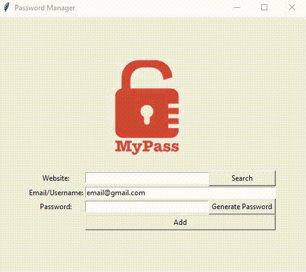

# Password Manager
I built this password manager with Python and the Tkinter GUI package.

## Usage:
- stores credentials in a JSON-file
- generates strong passwords
- lets user search for usernames and passwords by entering a website's name

### Possible further improvements
- check for redundancies
- delete entries
 

  

